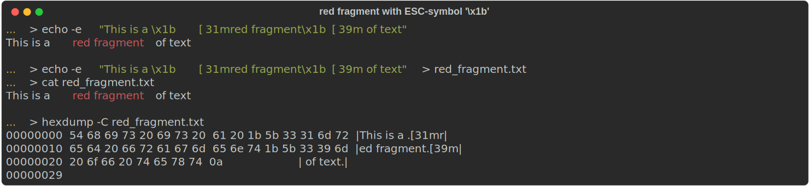

# ANSI Escape Sequences and HTML format

The way how text and background colors are rendered by terminal console is described 
[here](./ANSI-Escape-Sequences.md) and in multiple articles whose links are available 
[at the bottom](./ANSI-Escape-Sequences.md#Resources)

Before using those escape sequences and capture the result of their rendering in HTML format
we must realize the principle different between _sequence_-style approach in terminal's consoles 
and hierarchical _markup_-style approach that is used by internet browsers when they render
the content of HTML-document:

### Simple colored fragment of text

If we want some fragment of text to be displayed with different color following ANSI sequence-codes
should be used in command line (`echo` utility must be present quite everywhere):
```shell
echo -e "This is a \x1b[31mred fragment\x1b[39m of text"
```
or we can save the sequence of all those symbols in a text-file and render the content of that file with 
a regular utility like `cat` (at Windows a command `type` could be used instead):
```shell
echo -e "This is a \x1b[31mred fragment\x1b[39m of text" > some-temp-file.txt
cat some-temp-file.txt
```
In both cases the output must be a text with red fragment inside. The content of corresponding 
text-file (hexadecimal value of each character) can be obtained with `hexdump` utility:
<pre style="font-family:courier; background-color:WhiteSmoke; padding:16px">
... > hexdump -C some-temp-file.txt
00000000  54 68 69 73 20 69 73 20  61 20 1b 5b 33 31 6d 72  |This is a .[31mr|
00000010  65 64 20 66 72 61 67 6d  65 6e 74 1b 5b 33 39 6d  |ed fragment.[39m|
00000020  20 6f 66 20 74 65 78 74  0a                       | of text.|
00000029
</pre>

Some other utility can be used instead of `hexdump`, but the most interesting thing here that
the colored fragment is started with sequence of characters  `1b 5b 33 31 6d` and finished with 
sequence `1b 5b 33 39 6d`. In technical documentation the symbol with hexadecimal value `1b`
or decimal `27` is considered to call an _escape-symbol_ and use `ESC` term when refer to it. Subsequent
symbols after it are called _escape-sequence_. In case of terminal functions, which are responsible 
for colors and styles of text, that sequence should be started with `[` and finished with `m`.
So, in normal situation the user will never see anything that is surrounded with those escape-prefix 
and escape-suffix: `1b 5b xx xx .. .. .. 6d` or `ESC[..m`. In the example above two escape-sequences are used:
* `ESC[31m` - start using red foreground color to output the text
* `ESC[39m` - stop using just recently declared foreground color and return back to using the default one
- by the way the sequence `ESC[0m` would have quite the same effect, but it also reset to default the other 
text-styles (background, font-weight, ...) in addition to foreground color

The result of executing the commands above on MacOS terminal is following:


In `bash`-utilities and programming languages the characters of string literals could be represented
in several ways - so is _escape-symbol_. It's not readable in natural way like any alpha-numeric symbols,
it's denoted like `ESC` and has decimal integer value `27`, which is hexadecimal `1b`. In example above
we represented it as `\x1b` as part of argument to `echo`-command, but it also could be represented as:
- <details>
    <summary>`\033` as octal value of one-byte symbol</summary>
    Peek a boo!
  </details>
- <details>
    <summary>
        `\u001b` as two-byte UTF-8 symbol (this is also working in _Python_, _Java_ and other programming languages)
    </summary>
    Peek a boo again!
  </details>
- a good resource where all UTF-8 symbols are described is [here](https://design215.com/toolbox/utf8-4byte-characters.php)
